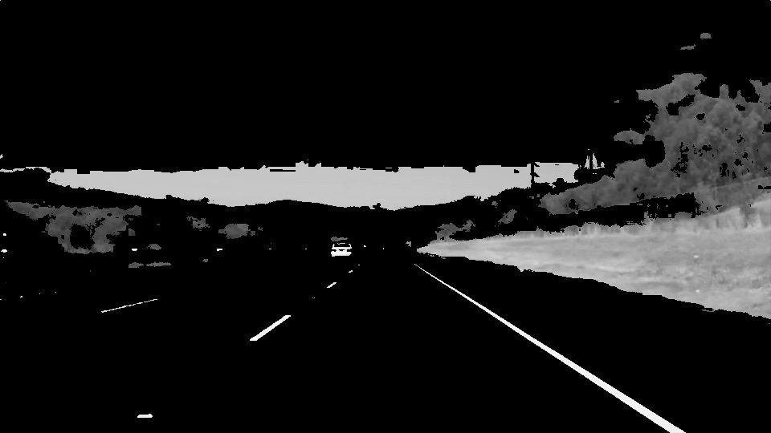
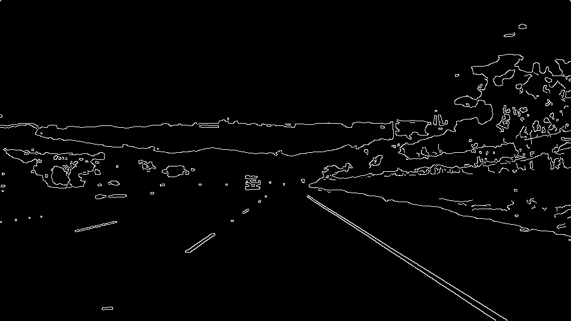
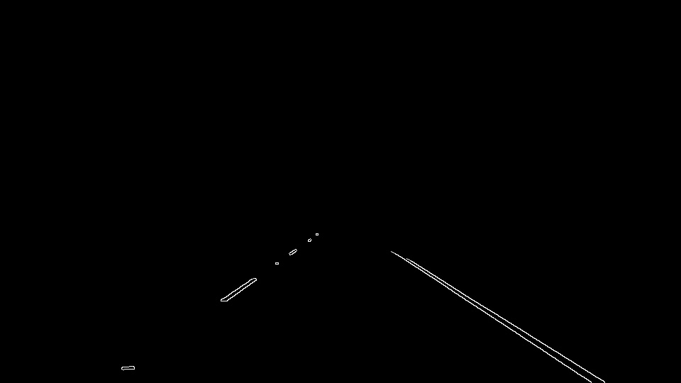
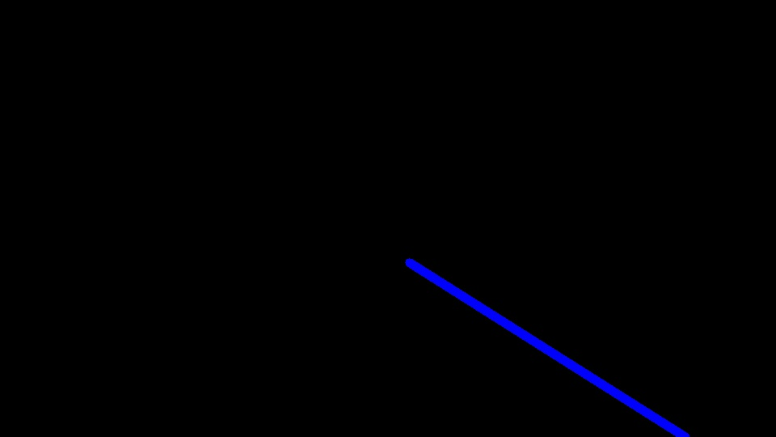
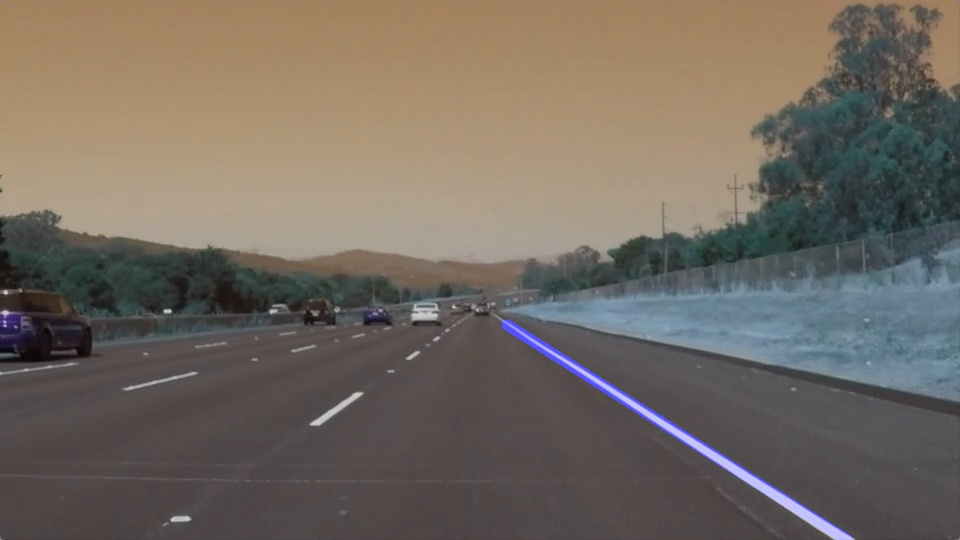

# **Finding Lane Lines on the Road** 

**Finding Lane Lines on the Road**

The goals / steps of this project are the following:

* Make a pipeline that finds lane lines on the road
* Reflect on your work in a written report

[//]: # (Image References)

[image1]: ./test_images/solidWhiteRight.jpg "solidWhiteRight"
---

### Reflection

### 1. Description

The pipeline consisted of 5 steps:

#### Step 1:

In the first step, I have converted the image into gray image using the helper function "**grayscale**". The input of function is the "original image",the output of the function looks like following:

#### Step 2:

In the second step, I used the helper function "**gaussian_blur**" , the input of this function is our grayed image and kernel size of "5". This function would denoise the gray_image to avoid false positives. The output of this step looks like following image:

#### Step 3:

In the third step I used the helper function "**canny**" to detect the edges. The input of the function is the denoised image(from step 2) with the **low_threshold =50**
and **high_threshold = 150** (ration of 1:3). The output of this step looks like following:

  

#### Step 4:

In this I am doing two tasks, first define a polygon which is actually the area where I wants to look for the lane. The polygon points are approximated as follow:

- Point A  = (width of the image,height of the image)
- Point B  = approx(*0.5***width of the image,0.6*height of image)
- Point C  = approx ((0.5***width of the image)+10,0.6*height of image) 
- Point D  = (0,height of the image) 

After defining the polygon , I used the function "**region_of_interest**",the input of the this function is the output of step 3(canny_image) and the above defined polygon.
The output of this function looks like following:

#### Step 5:

This is final step, which is actually doing three tasks, first it uses the Hough transform to get the lines from the image we got from step 4 and then it calls the method draw_lines().

The function **draw_lines()** takes the output of the Hough function and the image generated by the function **region_of_interest()**. 

In drawlines() function first  I am separating the Hough_lines in to two list "left-lines" and "right-lines" based  on the slope of the line as the slope of left line is  positive and the slope of right line is negative.

After creating the two lists of line I called the function **extrapolate_lines()**.
In this function I am averaging the position of each line in the list(**left_line** and **right_line**) so that I got the averaged two points(for each averaged line) to define the line. After that I just call **numpy.fitpoly()** function for each line so that I can the slope and intercept of the line. With the slope and intercept I calculated the points for line  which I have to draw on the image we got from function **region_of_interest()**

The output of the **extrapolate_lines()** looks like following:

In the end I am drawing both lines and original image together by using helper function **weighted_img()**, the combined image looks like as following:

### 2. Identify potential shortcomings with your current pipeline

One potential shortcoming of this pipeline appears in the scenario where I want to find lanes in a video, if the lane are not straight and have a curve then the lines are not drawing correctly. The more the lane has curve the more the line deviates from the lane. The short coming looks like following:

  

### 3. Suggest possible improvements to your pipeline

A possible improvement of the pipe line is to overcome the shortcoming defined above.
Currently I don't have any concrete idea how to solve the problem. May be taking the gradient of the curve could solve the problem but I am not sure I have to do some research on this problem. 
